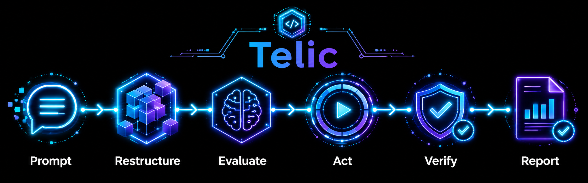
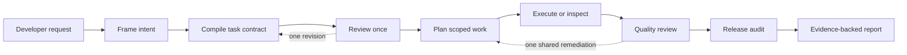

# Telic

> Turn a rough coding request into a permission-bounded, evidence-backed workflow.

Telic is a local MCP control plane for coding agents. It helps an active coding
host turn an ambiguous request into a grounded plan, inspectable work, verified
results, and an honest final report.

**Status:** executable local preview. The npm package provides the portable
`telic` CLI and STDIO MCP server. Codex has the reference source plugin. Six
additional host packs are available as experimental source adapters. Telic does
not call a model API, require a hosted service, or claim that it can intercept
every action taken by an IDE.



## The five-second idea

**Prompt. Restructure. Evaluate. Act. Verify. Report.**

You give your coding host a rough request. Telic helps the host frame the
intent, compile a typed task contract, review it once, plan scoped work, collect
evidence, check the result, and report what is actually supported.

The five roles are logical responsibilities performed by the active host model;
they are not five hosted Telic models. The deterministic controller enforces
schemas, phases, permissions, references, budgets, and terminal claims.

## Why Telic exists

Vague requests are useful starting points but poor execution contracts:

> “Investigate why the project is not talking to the API.”

Telic preserves the user's intent while making the missing pieces visible:

- what the task means and what is still unknown;
- which repository context was selected and why;
- whether the user requested analysis, a report, a plan, a fix, or both;
- which tools and paths are authorized;
- what evidence proves each acceptance criterion; and
- whether the final result is complete, partial, blocked, or unverified.

## How a run works



Telic asks one user-facing clarification question only when repository evidence
cannot resolve a material user-owned decision. A broader authority request
requires a new run. It does not run an unlimited autonomous loop.

## What is included

- `@dukeabaddon/telic` — npm-distributed `telic` CLI and local STDIO MCP server.
- `@telic/protocol` — strict Zod artifact schemas and cross-field contracts.
- `@telic/core` — deterministic state machine, permissions, budgets, SQLite
  metadata, and immutable content-addressed artifact bodies.
- `@telic/context` — bounded Git/ripgrep/filesystem grounding with path,
  symlink, duplicate, size, and heuristic secret controls.
- `@telic/mcp` — seven-tool local STDIO MCP server plus the portable
  `telic_workflow` prompt.
- `@telic/cli` — local `doctor`, `status`, `trace`, `artifact`, and `mcp`
  diagnostics.
- `plugins/telic` — Codex skill, marketplace metadata, MCP configuration, and
  standalone bundled server.
- `adapters/` — source-preview packs for Claude Code, Antigravity, Cursor, Kiro,
  Cline, and Roo Code.

## Quick start with npm

Requirements: Node.js `>=24.15.0`. Git and ripgrep improve discovery but are
optional.

Run without installing globally:

```bash
npx @dukeabaddon/telic doctor --json
```

Use the bundled STDIO MCP server from any MCP-compatible host:

```json
{
  "mcpServers": {
    "telic": {
      "command": "npx",
      "args": ["-y", "@dukeabaddon/telic", "mcp"],
      "env": {
        "TELIC_REPOSITORY_ROOT": "/absolute/path/to/target-project"
      }
    }
  }
}
```

Set `TELIC_STATE_DIR` when you want run state outside the default user state
directory.

## Build from source

Requirements: Node.js `>=24.15.0` and npm. Git and ripgrep improve discovery but
are optional.

```bash
git clone https://github.com/Dukeabaddon/Telic.git
cd Telic
npm ci
npm run build
npm test
node packages/cli/dist/bin.js doctor --json
```

The doctor command should return JSON with `"ok": true`. This builds Telic; the
next section connects it to Codex. Downloading a source archive is also valid
when Git is unavailable.

The normal state directory is outside the repository:

```text
${XDG_STATE_HOME:-$HOME/.local/state}/telic/repositories/<repository-hash>/
```

For an isolated run, set `TELIC_STATE_DIR` to a directory outside the project.

## Install the Codex plugin locally

Build the repository, then add its local marketplace:

```bash
codex plugin marketplace add "$PWD/.agents/plugins" --json
codex plugin add telic@personal --json
codex plugin list --json
codex mcp list --json
```

Restart Codex. Open `/skills` and select Telic, or mention the installed skill
directly:

```text
Use $telic:telic to investigate this repository. Analyze only; do not change files.
```

This is a local development installation. It does not publish Telic to a public
plugin directory. See [installation](docs/INSTALLATION.md).

## Advanced: connect a custom MCP client

The bundled process is a local STDIO MCP server. A compatible host normally
launches it and communicates through stdin/stdout; it is not a web server or an
interactive terminal application. Running this command by hand will wait for
an MCP client until you stop it with `Ctrl-C`.

```bash
TELIC_REPOSITORY_ROOT="$PWD" \
TELIC_STATE_DIR="$HOME/.local/state/telic-demo" \
node plugins/telic/dist/mcp/server.js
```

Equivalent client configuration uses absolute paths:

```json
{
  "mcpServers": {
    "telic": {
      "command": "node",
      "args": ["/absolute/path/to/Telic/plugins/telic/dist/mcp/server.js"],
      "env": {
        "TELIC_REPOSITORY_ROOT": "/absolute/path/to/target-project",
        "TELIC_STATE_DIR": "/absolute/path/outside-the-project/telic-state"
      }
    }
  }
}
```

The server uses stdout only for MCP protocol traffic and stderr for diagnostics.
It does not open a listening port or require a separate database service.
This path is mainly for adapter development, transport debugging, and custom
MCP clients. MCP connectivity alone does not make a host follow Telic's full
semantic workflow. See the [source-preview demo](docs/DEMO.md).

## Choose your host

One workflow name has different host-native spellings. Use `/telic` where the
host supports that form. In Codex, `/skills` opens the skill selector and
`$telic:telic` explicitly invokes the installed skill; a literal `/telic` is not
the Codex skill syntax.

| Active coding host | Activation                         | Source pack                        | Current evidence                                         |
| ------------------ | ---------------------------------- | ---------------------------------- | -------------------------------------------------------- |
| Codex              | `/skills` or `$telic:telic`        | `plugins/telic/`                   | Reference source plugin; local validation and smoke test |
| Claude Code        | `/telic:telic`                     | `adapters/claude-code/telic/`      | Config and STDIO smoke test; lifecycle untested          |
| Antigravity CLI    | `/telic`                           | `adapters/antigravity/telic/`      | CLI schema and preview-root smoke test                   |
| Cursor             | `/telic`                           | `adapters/cursor/project/.cursor/` | Project config and STDIO smoke test                      |
| Kiro CLI           | `/agent swap telic`, then `/telic` | `adapters/kiro/project/.kiro/`     | CLI schema and STDIO smoke test                          |
| Cline              | `/telic`                           | `adapters/cline/project/.cline/`   | Project config smoke test; Skills must be enabled        |
| Roo Code           | `/telic`                           | `adapters/roo-code/project/.roo/`  | Legacy project adapter; confirm the installed version    |

These are source-preview claims, not marketplace or lifecycle certification.
See [host adapter details](adapters/README.md).

An editor shell does not make its AI extensions share agents or MCP tools. For
example, Telic installed in the Codex extension inside Antigravity belongs to
Codex; Antigravity's native Agent panel needs its own adapter. Any extension can
use Telic when that extension can launch a local STDIO MCP server and activate a
skill, command, rule, or MCP prompt. Cloud-only agents cannot reach a process on
the user's laptop unless their sandbox can install it or a remote transport is
provided.

## Platform status

| Platform         | Current claim                                                                   |
| ---------------- | ------------------------------------------------------------------------------- |
| Linux x86-64     | Active development and local verification platform                              |
| Ubuntu and macOS | CI targets in the current candidate; compatibility requires a passing clean run |
| Native Windows   | Not supported yet; filesystem safety and path behavior need dedicated work      |
| WSL              | Not certified; treat it as a separate lifecycle target                          |

Node.js is cross-platform, but runtime availability alone does not prove Telic's
filesystem, permissions, plugin lifecycle, and cleanup behavior on that platform.

## Security boundary

Telic validates artifacts submitted through its MCP server. It does not intercept
shell, editor, browser, runtime, network, or subagent actions a host performs
directly outside Telic. Host sandboxing and user approvals remain the authority
for those native actions.

Run state can contain proprietary source and evidence. Read [SECURITY.md](SECURITY.md)
before using Telic with sensitive repositories.

## Repository map

```text
packages/protocol/   schemas and artifact contracts
packages/core/       controller, permissions, ledger, state machine
packages/context/    bounded repository grounding
packages/mcp/        local MCP service
packages/cli/        diagnostics and ledger inspection
plugins/telic/       Codex skill and bundled MCP server
adapters/            experimental host-native source packs
test/                cross-package conformance and plugin smoke tests
docs/                user, protocol, architecture, and quality references
```

## Documentation

- [Installation](docs/INSTALLATION.md)
- [API reference](docs/API.md)
- [Architecture](docs/ARCHITECTURE.md)
- [Protocol](docs/PROTOCOL.md)
- [Quality model](docs/QUALITY.md)
- [Adapter status](docs/ADAPTERS.md)
- [Example run](docs/EXAMPLE_RUN.md)
- [Source-preview demo](docs/DEMO.md)
- [Current status and limitations](docs/STATUS.md)
- [Third-party dependencies](docs/THIRD_PARTY.md)
- [Contributing](CONTRIBUTING.md)

## Help and contributing

Use GitHub Issues for reproducible, non-sensitive defects. Do not post secrets,
private source, or security proofs publicly. Read [SECURITY.md](SECURITY.md) for
the current reporting limitation and [CONTRIBUTING.md](CONTRIBUTING.md) before
submitting a change.

## License

Telic is released under the MIT License. See [LICENSE](LICENSE).
