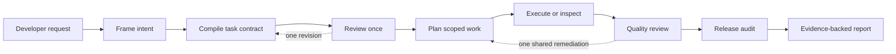

# Telic

> Turn a rough coding request into a permission-bounded, evidence-backed workflow.

Telic is a local MCP control plane for coding agents. It helps an active coding
host turn an ambiguous request into a grounded plan, inspectable work, verified
results, and an honest final report.

**Status:** executable source preview. The current packaged integration is a
Codex plugin. Telic does not call a model API, require a hosted service, or
claim that it can intercept every action taken by an IDE.


## The five-second idea

**Prompt. Restructure. Evaluate. Act. Verify. Report.**

You give your coding host a rough request. Telic helps the host frame the
intent, compile a typed task contract, review it once, plan scoped work, collect
evidence, check the result, and report what is actually supported.

The five roles are logical responsibilities performed by the active host model;
they are not five hosted Telic models. The deterministic controller enforces
schemas, phases, permissions, references, budgets, and terminal claims.

## Why Telic exists

Vague requests are useful starting points but poor execution contracts:

> “Investigate why the project is not talking to the API.”

Telic preserves the user's intent while making the missing pieces visible:

- what the task means and what is still unknown;
- which repository context was selected and why;
- whether the user requested analysis, a report, a plan, a fix, or both;
- which tools and paths are authorized;
- what evidence proves each acceptance criterion; and
- whether the final result is complete, partial, blocked, or unverified.

## How a run works



Telic asks one user-facing clarification question only when repository evidence
cannot resolve a material user-owned decision. A broader authority request
requires a new run. It does not run an unlimited autonomous loop.

## What is included

- `@telic/protocol` — strict Zod artifact schemas and cross-field contracts.
- `@telic/core` — deterministic state machine, permissions, budgets, SQLite
  metadata, and immutable content-addressed artifact bodies.
- `@telic/context` — bounded Git/ripgrep/filesystem grounding with path,
  symlink, duplicate, size, and heuristic secret controls.
- `@telic/mcp` — seven-tool local STDIO MCP server.
- `@telic/cli` — local `doctor`, `status`, `trace`, `artifact`, and `mcp`
  diagnostics.
- `plugins/telic` — Codex skill, marketplace metadata, MCP configuration, and
  standalone bundled server.

## Quick start

Requirements: Node.js `>=24.15.0` and npm. Git and ripgrep improve discovery but
are optional.

```bash
npm ci
npm run build
npm test
node packages/cli/dist/bin.js doctor --json
```

The normal state directory is outside the repository:

```text
${XDG_STATE_HOME:-$HOME/.local/state}/telic/repositories/<repository-hash>/
```

For an isolated run, set `TELIC_STATE_DIR` to a directory outside the project.

## Install the Codex plugin locally

Build the repository, then add its local marketplace:

```bash
codex plugin marketplace add "$PWD/.agents/plugins" --json
codex plugin add telic@personal --json
codex plugin list --json
codex mcp list --json
```

Restart Codex and activate the skill when needed:

```text
Use $telic:telic to investigate this repository. Analyze only; do not change files.
```

This is a local development installation. It does not publish Telic to a public
plugin directory. See [installation](docs/INSTALLATION.md).

## Use the MCP server directly

```bash
TELIC_REPOSITORY_ROOT="$PWD" \
TELIC_STATE_DIR="$HOME/.local/state/telic-demo" \
node plugins/telic/dist/mcp/server.js
```

The server uses stdout only for MCP protocol traffic and stderr for diagnostics.
It does not open a listening port or require a separate database service.

## Other coding hosts

The protocol and MCP server are designed to be portable. Any MCP-capable host
can potentially connect to the local STDIO server, but the current skill,
marketplace installation, and lifecycle tests are Codex-specific.

Claude Code, Cursor, Antigravity, Kiro, browser providers, and visual inspectors
are planned integrations, not current compatibility claims. MCP connectivity
alone does not provide Telic's host-specific skill behavior or guarantee that
native tools pass through Telic.

## Security boundary

Telic validates artifacts submitted through its MCP server. It does not intercept
shell, editor, browser, runtime, network, or subagent actions a host performs
directly outside Telic. Host sandboxing and user approvals remain the authority
for those native actions.

Run state can contain proprietary source and evidence. Read [SECURITY.md](SECURITY.md)
before using Telic with sensitive repositories.

## Repository map

```text
packages/protocol/   schemas and artifact contracts
packages/core/       controller, permissions, ledger, state machine
packages/context/    bounded repository grounding
packages/mcp/        local MCP service
packages/cli/        diagnostics and ledger inspection
plugins/telic/       Codex skill and bundled MCP server
test/                cross-package conformance and plugin smoke tests
docs/                user, protocol, architecture, and quality references
```

## Documentation

- [Installation](docs/INSTALLATION.md)
- [API reference](docs/API.md)
- [Architecture](docs/ARCHITECTURE.md)
- [Protocol](docs/PROTOCOL.md)
- [Quality model](docs/QUALITY.md)
- [Adapter status](docs/ADAPTERS.md)
- [Example run](docs/EXAMPLE_RUN.md)
- [Current status and limitations](docs/STATUS.md)
- [Third-party dependencies](docs/THIRD_PARTY.md)
- [Contributing](CONTRIBUTING.md)

## License

Telic is released under the MIT License. See [LICENSE](LICENSE).
