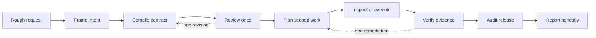

# Telic

> Rough request in. Evidence-backed workflow out.

[](https://www.npmjs.com/package/telic-mcp)

[](LICENSE)


Telic is an opt-in workflow plugin for coding agents. It turns an ambiguous
request into a permission-bounded task, guides the work, checks the evidence,
and reports only what can be supported.

**Status:** public preview. The Codex plugin is installable from this GitHub
repository. The portable CLI and local STDIO MCP server are published as
[`telic-mcp`](https://www.npmjs.com/package/telic-mcp). Telic uses the active
coding host's model; it has no hosted model service or separate API key.

## The five-second idea

**Prompt. Restructure. Evaluate. Act. Verify. Report.**

Give Codex a rough request. Telic grounds it in the repository, converts it into
a typed work contract, checks permissions before execution, and audits the
result before release.

## Try Telic in two minutes

You need Node.js `>=24.15.0`, Git, and a current
[Codex CLI](https://learn.chatgpt.com/docs/codex/cli) with plugin support. Git
is used to fetch the public marketplace repository.

```bash
node --version
git --version
codex --version
codex plugin marketplace add Dukeabaddon/Telic --json
codex plugin add telic@dukeabaddon-telic --json
codex plugin list --json
codex mcp list --json
```

If `codex --version` says the command is missing, the IDE extension may be
installed without exposing the CLI on your shell `PATH`. Complete the official
[Codex CLI setup](https://learn.chatgpt.com/docs/codex/cli), then reopen the
terminal before continuing.

Restart Codex or reload the IDE extension, then begin a new chat. The plugin
already bundles Telic's MCP configuration; do not add a second Telic server
manually.

Use `/skills` or explicitly mention the installed skill:

```text
Use $telic:telic.
This project keeps recommending the same result. I do not know whether the
ranking is broken or the data is biased. Analyze only.
```

`Analyze only` is ordinary language with a precise safety effect: Telic may
investigate, but it must not edit files or mutate runtime state.

### What you should see

- the request preserved as immutable input;
- relevant repository evidence selected with reasons;
- an explicit mode and permission ceiling;
- a bounded plan whose required checks are executable; and
- a final report separating proven facts, changes, and unresolved items.

## Why Telic

| Without a workflow contract                 | With Telic                                                 |
| ------------------------------------------- | ---------------------------------------------------------- |
| A vague prompt can silently expand in scope | Intent, scope, non-goals, and permissions are explicit     |
| “Done” may be only an agent claim           | Completion claims must reference recorded evidence         |
| Review loops can continue indefinitely      | One contract revision and one shared remediation are bound |
| Missing tools can produce confident guesses | Unavailable verification stays partial or unverified       |

Telic does not replace the coding agent. It gives the agent a workflow spine.

## When to use Telic

Telic never needs to run for every prompt. Activate it explicitly for work where
the extra structure pays for itself:

- ambiguous diagnoses;
- repository-wide or risky changes;
- security-sensitive work;
- analysis followed by a conditional fix; or
- tasks needing an inspectable evidence trail.

Skip Telic for simple questions, formatting, typo fixes, and obvious one-file
edits. In Codex, use `/skills` or `$telic:telic`; a literal `/telic` is not the
Codex skill syntax.

## How it works



The five agents in the design are logical roles: scenario author, task compiler,
quality controller, executor, and release auditor. The active host model can
perform them serially in one session. Telic itself does not make five model API
calls or claim hidden chain-of-thought.

## Permission modes

| Mode              | Outcome                                     | Mutation boundary                    |
| ----------------- | ------------------------------------------- | ------------------------------------ |
| `report_only`     | Explain supplied facts or existing results  | No new investigation or mutation     |
| `plan_only`       | Produce an actionable plan                  | Do not execute it                    |
| `analyze_only`    | Investigate and diagnose                    | Do not mutate files or runtime state |
| `fix_only`        | Apply a known, explicitly scoped correction | Change only the approved scope       |
| `analyze_and_fix` | Diagnose, then fix a supported root cause   | Mutation starts only after diagnosis |

Missing permission is denial. Telic does not silently broaden a request.

## Installation choices

| Path                           | What it installs                           | Status                     |
| ------------------------------ | ------------------------------------------ | -------------------------- |
| Codex Git marketplace          | Telic skill plus bundled local MCP server  | Recommended public preview |
| npm package `telic-mcp`        | Portable CLI and STDIO MCP tools only      | Published                  |
| Source adapters in `adapters/` | Host-specific skill/configuration overlays | Experimental               |

### Portable MCP and CLI

Use this route for custom MCP clients or diagnostics. It does **not** install
the Telic workflow skill into Codex.

```bash
npx -y telic-mcp doctor --json
```

Run that command in the target project, not inside a Telic source checkout. A
generic STDIO MCP client can launch:

```json
{
  "mcpServers": {
    "telic": {
      "command": "npx",
      "args": ["-y", "telic-mcp", "mcp"],
      "env": {
        "TELIC_REPOSITORY_ROOT": "/absolute/path/to/target-project"
      }
    }
  }
}
```

MCP connectivity exposes Telic's deterministic tools and portable prompt. A
host still needs a skill, command, or equivalent driver to follow the complete
workflow. See [Installation](docs/INSTALLATION.md).

## Host and platform compatibility

| Host             | Activation                         | Current evidence                           |
| ---------------- | ---------------------------------- | ------------------------------------------ |
| Codex            | `/skills` or `$telic:telic`        | Reference plugin; install and smoke tested |
| Claude Code      | `/telic:telic`                     | Source adapter; lifecycle not certified    |
| Antigravity CLI  | `/telic`                           | Source adapter; lifecycle not certified    |
| Cursor           | `/telic`                           | Source adapter; lifecycle not certified    |
| Kiro CLI         | `/agent swap telic`, then `/telic` | Source adapter; lifecycle not certified    |
| Cline / Roo Code | `/telic`                           | Source adapters; lifecycle not certified   |

An editor and its AI extensions are separate hosts. For example, the Codex
extension inside Antigravity can use the Codex plugin; Antigravity's native
Agent panel needs its own adapter.

- Linux x86-64 is the active development platform.
- Ubuntu and macOS are CI targets, pending clean lifecycle certification.
- Native Windows is unsupported; WSL is not certified.

See [adapter details](docs/ADAPTERS.md) and
[current limitations](docs/STATUS.md) before relying on another host.

## Built with Codex during Build Week

Codex helped turn the initial product discussion into an executable protocol,
controller invariants, adversarial tests, a packaged local MCP server, host
adapter checks, and release documentation.

The important engineering decisions remained explicit and reviewable:

- preserve the original request;
- require explicit Telic activation;
- deny missing permission;
- bound review and remediation loops;
- keep the MCP runtime model-free; and
- require evidence before final claims.

No model-version claim is made here without separately preserved session proof.

## Security and local data

Telic validates artifacts submitted through its MCP server. It cannot intercept
shell, editor, browser, runtime, network, or subagent actions a host performs
outside that server. Host sandboxing and user approvals remain authoritative.

Selected source and evidence are stored exactly in a local, content-addressed
ledger. Hashing provides identity and integrity; it is not anonymization. Secret
filtering is heuristic. Do not use Telic on repositories whose contents you are
unwilling to store locally.

Default state lives outside the repository:

```text
${XDG_STATE_HOME:-$HOME/.local/state}/telic/repositories/<repository-hash>/
```

Read [Security](SECURITY.md) and [Privacy](PRIVACY.md) before using sensitive
repositories.

## Architecture for developers

```text
packages/protocol/   strict schemas and artifact contracts
packages/core/       controller, permissions, ledger, and state machine
packages/context/    bounded repository grounding and safety controls
packages/mcp/        local model-free MCP service
packages/cli/        doctor and ledger diagnostics
plugins/telic/       Codex skill and bundled MCP server
adapters/            experimental host-specific source packs
test/                cross-package conformance and smoke tests
```

The controller currently accepts deterministic serial WorkPlans. Browser and
DevTools providers, graph retrieval, semantic compression, visual inspection,
and host-wide tool interception are not shipped.

## Develop and verify

```bash
git clone https://github.com/Dukeabaddon/Telic.git
cd Telic
npm ci
npm run check
node packages/cli/dist/bin.js doctor --json
```

`npm run check` checks formatting, builds, runs threshold-enforced coverage,
validates the Codex assets and marketplace, and validates every source adapter. See
[Contributing](CONTRIBUTING.md) for the artifact-first workflow.

## Documentation and support

- [Installation](docs/INSTALLATION.md)
- [Demo guide](docs/DEMO.md)
- [Architecture](docs/ARCHITECTURE.md)
- [Protocol](docs/PROTOCOL.md)
- [API reference](docs/API.md)
- [Example run](docs/EXAMPLE_RUN.md)
- [Current status](docs/STATUS.md)
- [Contributing](CONTRIBUTING.md)
- [Security policy](SECURITY.md)
- [Privacy](PRIVACY.md)
- [Terms](TERMS.md)

Use [GitHub Issues](https://github.com/Dukeabaddon/Telic/issues) for
reproducible, non-sensitive defects. Do not publish secrets or private source in
an issue.

## License

Telic is released under the [MIT License](LICENSE).
