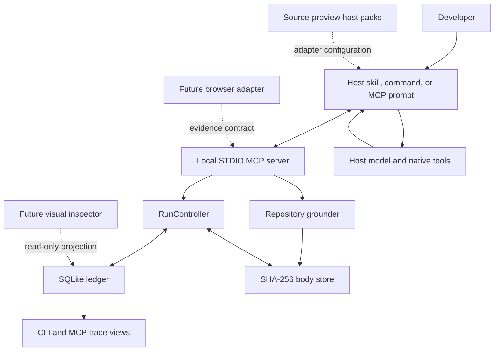
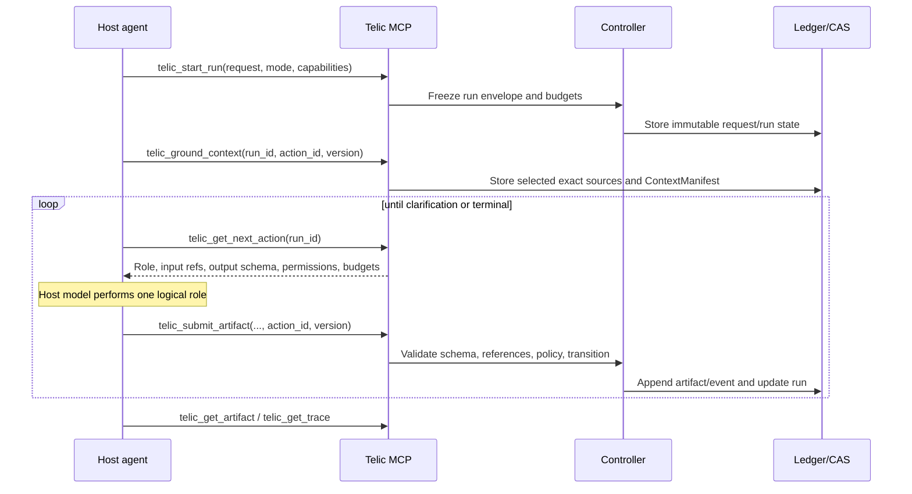
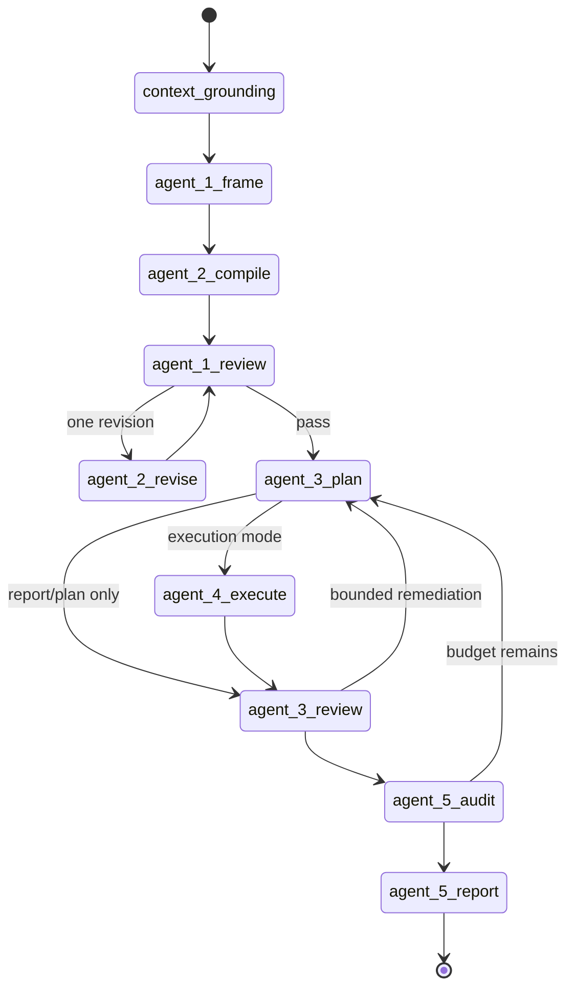

# Telic architecture

**Status:** Executable local control plane with a Codex reference integration and six source-preview host packs.

## Objective

Telic lets an existing coding host compile a developer request into strict, repository-grounded artifacts and an evidence-backed result. Reasoning stays in the host model; deterministic software owns workflow state, schema validation, bounded context, immutable storage, and observable handoffs.

The architecture separates:

- **semantic reasoning:** logical roles performed by the current host model;
- **control:** deterministic phase, budget, reference, and artifact acceptance;
- **context:** local, bounded repository selection;
- **persistence:** SQLite metadata plus immutable content-addressed bodies; and
- **integration:** a local STDIO MCP facade plus thin host skills and configuration.

## Current component map



### `@telic/protocol`

Owns strict Zod v4 schemas and parsing for run/controller, intent, execution, evidence, release, and trace artifacts. Canonical JSON bodies are camelCase, reject unknown fields, and use `schemaVersion: "1.0"`. Context inventory's internal snake_case wire record is normalized here before ledger acceptance.

### `@telic/core`

Owns run state, legal phase/artifact transitions, retry budgets, permission projection, canonical JSON, SQLite metadata/events, and content-addressed artifact bodies. Artifacts are append-only per run and digest-verified when hydrated.

The controller never invokes a model. It accepts an artifact authored by the host, validates it, appends it, updates the run version/state, and projects the next action.

### `@telic/context`

Inventories repository files using Git, then ripgrep, then a filesystem fallback. It applies deterministic request/path scoring, active-path boosts, file/count/byte budgets, generated/dependency/path exclusions, realpath containment, symlink checks, UTF-8/binary checks, deduplication, and heuristic secret detection. Selected text is stored once; the trace-safe manifest carries hashes, references, reasons, warnings, and totals rather than replaying content.

Tree-sitter, LSP symbols, code graphs, and lossy compression are not implemented.

### `@telic/mcp`

Exposes seven tools over local STDIO: start, ground, next action, submit artifact/clarification, inspect run, retrieve artifact, and inspect trace. It also exposes the host-neutral `telic_workflow` prompt. It composes protocol/core/context behavior and writes protocol JSON only to stdout.

MCP is not a prompt interceptor, model service, native-agent API, or universal host-policy hook. It can fail a Telic artifact submission; it cannot prevent a direct host-native shell/editor/browser action that bypasses its tools.

### `@telic/cli`

Exposes source-built diagnostics and ledger views. It can start the MCP server, but it is not an installer or workflow-driving model client.

### `plugins/telic`

Packages the Codex reference integration: plugin metadata, the `telic:telic` skill, local MCP configuration, and an esbuild-produced standalone server. The skill is the turn driver.

### `adapters/`

Contains source-preview packs for Claude Code, Antigravity, Cursor, Kiro, Cline, and Roo Code. Their host-specific manifests or project configuration point to the same generated standalone server and canonical skill. Repository checks validate their files and complete local STDIO handshakes. Those checks prove package shape and protocol compatibility, not every host's installation lifecycle or marketplace approval.

## Host-driven loop



The controller returns only references needed by the phase. The host explicitly retrieves artifacts and authors the required output. The current controller accepts deterministic serial WorkPlans only. Native parallel scheduling remains planned; a host may still use a bounded subagent for a single authorized semantic role without claiming parallel plan execution.

## Phase state machine



Eligible pre-audit phases may pause for a `ClarificationRequest` and resume after a user response. Terminal states are completed, partial, blocked, or cancelled; `UserReport` may also report failed verification.

The diagram is the intended current routing. [STATUS.md](STATUS.md) calls out any mode or multi-node edge still under audit.

## Permissions and authority

The run records user mode, host capabilities, granted/denied capability identifiers, and budgets. Later artifacts cannot broaden the requested mode. Missing permission is denial.

At artifact acceptance, the controller checks legal phase/type, canonical identifiers and run, reference ownership/existence/type where applicable, mode consistency, work-plan and acceptance mappings, and non-mutation claims. The permission model distinguishes repository, shell, runtime, browser, network, and subagent scopes.

This is a control-plane boundary, not OS isolation. Preventing actions performed directly by the host requires the host sandbox, user approval, or a future enforceable adapter hook. Review artifacts may detect a violation after the fact; detection is not interception.

## Persistence

Default per-repository state:

```text
${XDG_STATE_HOME:-$HOME/.local/state}/telic/repositories/<repository-hash>/
├── ledger.sqlite3
└── artifacts/...
```

`TELIC_STATE_DIR` overrides the directory. The repository hash comes from the real absolute repository path. State creation uses restrictive local permissions and rejects unsafe symlink state paths.

SQLite stores run state, artifact metadata, references, and event summaries. Canonical JSON bodies are stored by SHA-256 content identity. Retrieval recomputes the digest. This catches ordinary mismatch/corruption and deduplicates identical bodies; it is not encryption and is not adversarially tamper-proof against a process with the same OS-user access to both database and blobs.

## Context and trust

The original user request and controller artifacts are immutable. Repository files, logs, browser content, tool descriptions, and model output are untrusted evidence, not permission-granting instructions. Applicable project rules must be recognized by the host/controller boundary and retained with provenance.

Context security is defense in depth:

- canonical repository root and realpath containment;
- symlink/path escape rejection;
- generated, dependency, metadata, and secret-like path exclusions;
- bounded reads and inventory budgets;
- binary/invalid UTF-8 filtering;
- duplicate-content hashes; and
- heuristic content-secret detection.

Heuristics can have false positives and false negatives. Exact selected sources may contain sensitive information and remain local in the artifact store.

## Observability

Run/artifact/trace tools and the CLI expose:

- phase/status/version and remaining budgets;
- immutable artifact metadata and exact bodies on explicit retrieval;
- selected/excluded context and byte totals;
- actor, input/output references, decisions, and transition summaries; and
- terminal report and evidence lineage.

Telic records concise decision summaries, not private chain-of-thought. A visual inspector is planned as a read-only projection of the same data.

## Failure behavior

| Failure                                         | Current/required behavior                                                     |
| ----------------------------------------------- | ----------------------------------------------------------------------------- |
| Malformed or extra artifact fields              | Reject with validation error; do not advance                                  |
| Wrong phase/type or cross-run/missing reference | Reject; do not append the phase artifact                                      |
| Material user-owned ambiguity                   | Pause with one bounded clarification artifact                                 |
| Contract review requests a second revision      | Block when revision budget is exhausted                                       |
| Remediation budget exhausted                    | Continue to honest partial/blocked audit/report                               |
| Git/ripgrep unavailable                         | Fall back deterministically and record warnings                               |
| Path/symlink escape or secret-like source       | Exclude and record the reason                                                 |
| Browser unavailable                             | Host reports unverified/blocked browser acceptance; no evidence is fabricated |
| Host disconnect                                 | Durable state remains; a future/restarted host can inspect the run            |
| Content digest mismatch                         | Artifact retrieval fails closed                                               |

## Planned extensions

- enforceable host action mediation through supported hooks/tool wrappers;
- browser/DevTools provider contract and synthetic-profile evidence;
- certified host installation lifecycles and wider adapter conformance;
- richer multi-node scheduling/parallel lifecycle;
- Tree-sitter/LSP/code-graph context providers;
- read-only visual inspector;
- retention and per-run deletion commands; and
- signed/pinned public distribution.
