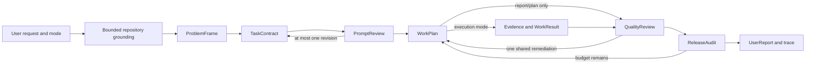

# Telic product definition

**Status:** Executable control-plane source preview; host experience and release packaging remain incomplete.

## Product summary

Telic is a local, model-independent intent compiler and evidence ledger for coding agents. It converts an imprecise developer request into a repository-grounded, permission-aware task contract; bounds one semantic review; plans work; accepts evidence-backed results; and produces an independently audited report. Early contract blocks now produce a blocked `UserReport`; cancellation and superseded-run closure remain narrower terminal cases.

Telic runs inside the developer's existing coding environment. The host model authors semantic artifacts. The Telic runtime validates, stores, and advances them and never calls a model API.

> From rough request to grounded contract to verified result, with every handoff inspectable.

The repository currently proves the deterministic control-plane slice, a source-built Codex reference integration, and six experimental host packs. It does not yet prove a polished end-user run across every mode or host. See [STATUS.md](STATUS.md).

## Problem

A request such as:

> Investigate why the project is not talking. Check DevTools and the logs.

may omit the failing boundary, intended outcome, repository rules, edge cases, verification, and write authorization. An unstructured agent can infer the wrong scope, load irrelevant context, mutate during diagnosis, stop before verification, or make completion claims without evidence.

Telic compiles that request into typed artifacts and uses bounded gates before and after work. It is not a prompt-framework quiz or a longer-prompt generator; the product outcome is faithful, permission-aware execution with inspectable evidence.

## Users

- **Agent-native developer:** wants better execution inside an existing coding host without copying prompts into a separate site.
- **Technical lead/reviewer:** wants acceptance criteria, rule coverage, exact evidence, bounded retries, and honest unresolved risk.
- **Workflow/adapter author:** wants stable role handoffs and a portable protocol separated from host-specific commands and agents.

## Product principles

1. Compile intent into a typed contract, not decorative prose.
2. Ground repository facts before generating a scenario or plan.
3. Clarify only a material user-owned divergence; discover local facts instead of asking for them.
4. Freeze the requested outcome mode and never broaden authority silently.
5. Keep schemas, transitions, budgets, and artifact acceptance deterministic.
6. Use the current host model; the local runtime has no model credential.
7. Treat multiple agents as an optional execution strategy, not a product requirement.
8. Preserve exact evidence once and pass references with provenance.
9. Expose inputs, outputs, decisions, scores, and concise rationale—not hidden chain-of-thought.
10. Bound every review and remediation loop.

## Outcome modes

| Mode              | User outcome                                             | Mutation policy                                       |
| ----------------- | -------------------------------------------------------- | ----------------------------------------------------- |
| `report_only`     | Synthesize already supplied artifacts/evidence           | No new repository discovery or execution; no mutation |
| `plan_only`       | Produce a plan, risks, and validation strategy           | No executor phase; no mutation                        |
| `analyze_only`    | Inspect repository/runtime/browser evidence and diagnose | Read-only                                             |
| `fix_only`        | Apply an already specified/supported change and verify   | Contract-scoped writes only                           |
| `analyze_and_fix` | Diagnose, then apply a supported change and verify       | Read-only diagnosis before explicitly gated writes    |

The controller routes report- and plan-only runs around execution and validates non-mutation claims at artifact boundaries. Direct actions taken through host-native tools remain subject to host sandboxing and approval; the current MCP server does not intercept them. Until diagnosis-to-mutation gating for `analyze_and_fix` is fully audited, adapters should use conservative host approval.

## Five logical roles

The roles are responsibilities, not five permanent model processes.

### Agent 1: Scenario author and intent guardian

Produces the authoritative `ProblemFrame`: sourced facts, inferences, unknowns, scope, constraints, risks, acceptance criteria, and a frozen readiness rubric. It may also produce an optional `ScenarioSpec` presentation. After compilation it issues one `PromptReview` and may request at most one contract revision.

### Agent 2: Task compiler

Produces the `TaskContract` with objective, mode, references, constraints, permissions, evidence requirements, output contract, and done conditions. The structure changes by task class: diagnosis, feature, UI, infrastructure, or report. It may revise once in response to Agent 1.

### Agent 3: Planner and quality controller

Produces a dependency-aware `WorkPlan`, then compares `WorkResult` artifacts to every acceptance criterion, applicable rule, permission, and evidence requirement. It recommends pass, partial, block, or one bounded remediation. Deterministic code—not Agent 3—owns legal state and budgets.

### Agent 4: Executor

Performs only authorized investigation or implementation through the host. It captures redacted `Evidence` and returns typed findings, actions, file changes, checks, and unresolved issues. Native subagents are optional and capability-negotiated.

### Agent 5: Release auditor and reporter

Independently checks the original request, approved contract, work results, quality review, evidence, and mode compliance. It emits a `ReleaseAudit` and final `UserReport`, or one contract-backed remediation when budget remains.

## Flow

The host obtains each `NextAction`, performs the logical reasoning turn, and submits the strict artifact. Agents do not maintain a hidden peer-to-peer conversation.

## Current product surface

- local protocol/controller/context/ledger packages;
- seven-tool STDIO MCP server plus the portable `telic_workflow` prompt;
- source-built diagnostics and trace CLI;
- Codex plugin and skill as the reference host driver;
- six experimental source packs for Claude Code, Antigravity, Cursor, Kiro, Cline, and Roo Code;
- all five intent modes in the protocol, with conservative limits documented in [STATUS.md](STATUS.md);
- content-addressed exact artifacts and bounded context manifests;
- terminal trace output and artifact retrieval.

Current source does **not** include browser/DevTools integration, a visual
inspector, host-wide tool interception, a certified non-Codex lifecycle, a
public package, or a hosted service. Six non-Codex source adapter packs are
experimental integration artifacts, not supported-release claims.

## Context efficiency

Telic promises less repeated and less irrelevant context, not universal token compression. The implementation:

1. inventories with Git, ripgrep, or a filesystem fallback;
2. ranks likely relevant files deterministically;
3. enforces file/count/byte budgets;
4. stores exact selected text once by SHA-256;
5. records selection/exclusion reasons and repository fingerprint; and
6. passes immutable artifact references between phases.

Tree-sitter/LSP graphs, Graphifyy, Serena, Repomix export, and LLMLingua remain optional research. Critical instructions, permissions, code, errors, diffs, and verification evidence must not be lossily compressed.

## Inspectability

Today, MCP and CLI expose run state, immutable artifacts, phase transitions, evidence references, budgets, and concise decision summaries. A visual read-only inspector remains planned. Telic never asks a host to reveal hidden chain-of-thought.

## Non-goals

Telic is not:

- a standalone chat website or prompt-training game;
- a universal prompt/tool interceptor;
- a replacement for the host model, sandbox, or user approval system;
- an MCP server that performs hidden model reasoning;
- an unbounded recursive swarm;
- a guarantee that more model roles always improve a task;
- an autonomous production operator; or
- a mechanism for claiming token savings the host cannot measure.

## Success criteria

For the hackathon MVP, Telic succeeds when one clean Codex installation can complete a realistic repository run that:

- converts a vague request into a faithful grounded contract;
- asks no unnecessary clarification;
- proves the selected mode was respected;
- shows the one bounded contract review and post-execution audit;
- maps every completion claim to exact evidence;
- works serially without native subagents;
- requires no second model API key; and
- returns a concise report plus inspectable trace.

## Risks and controls

| Risk                           | Control or current limit                                                                            |
| ------------------------------ | --------------------------------------------------------------------------------------------------- |
| More roles add latency/context | Serial fallback, bounded loops, exact references; direct-path optimization remains future work      |
| Scenario invents facts         | `ProblemFrame` separates facts/inferences/unknowns and requires provenance                          |
| Review rewards prompt style    | Frozen rubric, hard gates, and evidence-backed acceptance mapping                                   |
| Agent expands authority        | Deterministic mode/phase/artifact checks; host-native prevention still relies on host policy        |
| Evidence contains secrets      | Path/content heuristics and redaction metadata; not a complete secret scanner                       |
| Local state is modified        | SHA checks and restricted local paths; not tamper-proof against a malicious same user               |
| Cross-host behavior differs    | Portable schemas, one Codex reference, six checked preview packs, and explicit certification limits |
