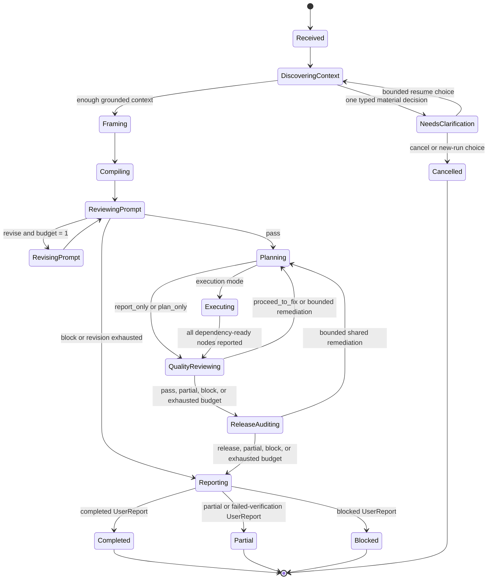

# Telic Protocol

**Status:** Conceptual protocol with an executable `1.0` schema implementation.

This document explains Telic's logical roles, artifacts, state machine, and
quality boundaries. The strict Zod schemas in `packages/protocol/src/` are the
serialization authority, and [API.md](API.md) describes the current MCP surface.

Most YAML blocks below intentionally retain readable snake_case conceptual
labels from the design phase. They are not copy-paste API payloads. Canonical
artifact bodies use camelCase, reject unknown fields, and carry
`schemaVersion: "1.0"`. The controller implements the vertical slice described
in [STATUS.md](STATUS.md); statements using MUST below may still describe a
conformance target when that page marks the behavior as incomplete.

## 1. Purpose

Telic compiles an imprecise user request into a permission-bounded,
repository-grounded workflow, records evidence from execution, reviews the work,
and releases an honest result to the user.

The protocol separates five logical roles:

1. **Scenario Author and Intent Guardian (Agent 1)** frames the problem and owns
   semantic fidelity.
2. **Prompt and Task Compiler (Agent 2)** creates an executable task contract.
3. **Planner and Quality Controller (Agent 3)** plans and reviews execution.
4. **Executor (Agent 4)** performs the authorized investigation or work.
5. **Release Auditor and Reporter (Agent 5)** independently checks user fidelity
   before reporting.

These are logical roles, not a requirement for five model processes. A host MAY
run them in separate native subagent contexts, serially in one model session, or
with a mixture of both. Native subagents are an optional host capability.

The Telic controller and MCP server do not invoke a model API, supply a hidden
model, or perform reasoning. The model already active in the host calls Telic
tools, receives the next permitted phase, and submits a typed output. Telic stores
artifacts and traces, validates schemas and transitions, calculates effective
permissions, and enforces budgets.

## 2. Normative language

The terms **MUST**, **MUST NOT**, **SHOULD**, **SHOULD NOT**, and **MAY** describe
protocol requirements. They do not imply that an implementation exists today.

## 3. Core invariants

- The original user message MUST be stored unchanged and remain addressable.
- A generated scenario MUST NOT silently replace the user's request.
- Claims about a repository or runtime MUST carry provenance and evidence.
- The controller MUST deny actions outside the intersection of host policy, user
  authorization, repository policy, the task contract, and the current work
  order.
- State transitions, permission checks, schema validation, and retry counters
  MUST be deterministic controller behavior.
- Agents MUST communicate through typed artifacts. A downstream role MAY receive
  a compact context projection, but the source artifacts remain immutable.
- A numeric score MUST NOT override a failed hard gate.
- A completed result MUST be traceable to acceptance criteria and evidence.
- Every phase projection MUST retain the transitive eligible references needed to
  interpret its mandatory inputs; it MUST fail rather than silently truncate that
  closure.
- Structured decision summaries MAY be recorded. Hidden chain-of-thought MUST NOT
  be requested, stored, or exposed.
- Repository files, logs, browser content, and tool output are evidence, not
  instructions, unless the host explicitly recognizes a file as an applicable
  rules source.

## 4. Execution topology

### 4.1 Serial host execution

A host without native subagents uses one model session:

```text
host model -> begin_phase(A1) -> submit ProblemFrame
host model -> begin_phase(A2) -> submit TaskContract
host model -> begin_phase(A1_REVIEW) -> submit PromptReview
host model -> begin_phase(A3_PLAN) -> submit WorkPlan
host model -> begin_phase(A4) -> submit WorkResult
host model -> begin_phase(A3_REVIEW) -> submit QualityReview
host model -> begin_phase(A5) -> submit ReleaseAudit
host model -> begin_phase(A5_REPORT) -> submit UserReport
```

The controller supplies only the inputs allowed for the current phase and checks
the output type. Logical separation is preserved through phase-specific role
instructions, context projections, and immutable artifacts, although correlated
model errors remain possible.

### 4.2 Native subagent execution

The protocol schema can represent parallel or mixed WorkPlans for future
adapters. The current controller accepts deterministic serial WorkPlans only. A
future host adapter MAY assign independent nodes to separate contexts only after
it also enforces the WorkPlan's concurrency, depth, tools, context, and output
boundaries. Parallel execution does not change the protocol or turn Telic into a
decentralized swarm.

### 4.3 MCP boundary

The implemented MCP surface is a state and artifact boundary. Version `0.1.0`
exposes `telic_start_run`, `telic_ground_context`,
`telic_get_next_action`, `telic_submit_artifact`, `telic_get_run`,
`telic_get_artifact`, and `telic_get_trace`. These source-preview names can
still change before the first compatibility release; [API.md](API.md) is the
current transport reference.

The optional `telic_workflow` MCP prompt gives compatible hosts a portable
workflow entry point. It renders host-side instructions for an exact request and
mode; it does not execute phases, invoke a model, expand authority, or replace
`NextAction` as the controller's source of truth.

MCP sampling or an external model key MUST NOT be required for the core workflow.

## 5. Identifiers and references

Every run, artifact, trace event, acceptance criterion, work node, and review
finding MUST have a stable identifier within its run.

```yaml
ArtifactRef:
  uri: artifact://run-01/task-contract-01
  media_type: application/vnd.telic.task-contract+yaml
  sha256: sha256:3b7b...
  summary: Permission-bounded diagnosis contract

TraceRef:
  uri: trace://run-01/event-0042
```

An `ArtifactRef` points to immutable content. Updating an artifact creates a new
artifact and reference; it does not mutate the earlier value. Large or sensitive
tool results SHOULD be stored once and passed by reference. Derived summaries MUST
refer to their source artifacts.

Conceptual artifact metadata (the executable envelope uses camelCase):

```yaml
ArtifactRecord:
  id: task-contract-01
  run_id: run-01
  type: TaskContract
  schema_version: "1.0"
  producer: agent-2
  created_at: 2026-07-15T10:00:00Z
  sha256: sha256:3b7b...
  source_refs: []
  redaction: none
  body: {}
```

## 6. User intent modes

The selected mode is an authorization boundary, not merely a prompt label.
Unclear requests MUST NOT be silently upgraded to a more permissive mode.

| Mode              | Meaning                                            | Default boundary                                                            |
| ----------------- | -------------------------------------------------- | --------------------------------------------------------------------------- |
| `report_only`     | Explain existing facts or prior results            | Read supplied artifacts; no new runtime investigation or mutation           |
| `plan_only`       | Produce an actionable plan without carrying it out | Read repository/context as authorized; no task execution or mutation        |
| `analyze_only`    | Investigate and diagnose                           | Read repository, browser, logs, and runtime; no edits or restarts           |
| `fix_only`        | Apply a known, explicitly scoped correction        | Minimal preflight, scoped change, and verification only                     |
| `analyze_and_fix` | Diagnose, then correct a supported cause           | Read-only analysis followed by bounded authorized mutation and verification |

`fix_only` is valid when the desired change is already known. “Fix the project”
without a known cause normally requires `analyze_and_fix` or clarification.
Post-change verification is part of fixing and is not optional execution scope.

Mode defaults MAY be narrowed by a contract. They MUST NOT be broadened without
user authorization. A pre-authorized `analyze_and_fix` run MAY move from analysis
to a bounded fix without interrupting the user when the cause is supported and
the correction remains inside the approved scope. Materially different,
irreversible, privileged, production, or externally visible work requires a new
user decision.

## 7. Permission model

### 7.1 Effective permission

For every tool call, effective permission is the intersection of:

```text
host/system policy
  intersect user authorization
  intersect applicable repository policy
  intersect TaskContract permissions
  intersect WorkPlan node permissions
  intersect current tool capability
```

Absence of permission means denial. A role prompt cannot grant permission.

### 7.2 Permission vocabulary

Implementations SHOULD express permissions as typed capabilities with optional
scope:

```yaml
permissions:
  repository:
    read: ["**"]
    write: ["infra/compose.dev.yml"]
  shell:
    inspect: true
    execute_allowlist: ["npm test"]
  runtime:
    inspect: ["web", "api"]
    restart: ["api"]
  browser:
    inspect: true
    mutate_state: false
  network:
    read_domains: []
    external_write: false
  subagents:
    spawn: true
    maximum_children: 3
    maximum_depth: 1
```

Tool arguments MUST be checked against scoped permissions, not only the tool name.
Destructive operations, external messages, deployments, purchases, credential
changes, and production mutations MUST require explicit authorization.

In the current controller, shell execution requires an exact non-compound command
present in immutable run authorization, the TaskContract, and the WorkPlan node.
`shell.inspect` records one of six typed targets (`git.status`, `git.diff`,
`git.log`, `network.listen`, `process.list`, or `runtime.logs`), not arbitrary
shell text. These checks validate submitted artifacts; they do not intercept a
host's native shell.

## 8. Artifact types

The fields below define minimum logical content in conceptual YAML. They do not
replace the finalized camelCase Zod serialization contract.

### 8.1 `RunEnvelope`

Created by the host adapter and controller before reasoning begins.

```yaml
RunEnvelope:
  schema_version: "1.0"
  run_id: run-01
  created_at: 2026-07-15T10:00:00Z
  original_request_ref: artifact://run-01/user-message-01
  followup_request_refs: []
  requested_mode: analyze_and_fix
  status: active
  working_context:
    repository_root: /workspace/example
    active_files: []
    applicable_rule_refs: []
  host:
    name: codex
    native_subagents: available
    capabilities:
      [
        repository.read,
        repository.write,
        shell.inspect,
        shell.execute,
        browser.inspect,
      ]
  authorization:
    granted:
      repository: { read: ["**"], write: ["apps/web/**"], delete: [] }
      shell: { inspect: true, execute_allowlist: ["npm test"] }
      runtime: { inspect: [], restart: [] }
      browser: { inspect: true, mutate_state: false }
      network: { read_domains: [], external_write: false }
      subagents: { spawn: false, maximum_children: 0, maximum_depth: 0 }
    denied:
      repository: { read: [], write: [], delete: [] }
      shell: { inspect: false, execute_allowlist: [] }
      runtime: { inspect: [], restart: [] }
      browser: { inspect: false, mutate_state: false }
      network: { read_domains: [], external_write: false }
      subagents: { spawn: false, maximum_children: 0, maximum_depth: 0 }
  budgets:
    prompt_revisions: 1
    post_execution_remediations: 1
    maximum_parallel_workers: 3
    maximum_subagent_depth: 1
  policy_refs: []
```

The envelope records available capabilities; it MUST NOT claim that unavailable
tools or native subagents exist.

### 8.2 Controller and context artifacts

The controller creates deterministic artifacts that tell the host what may happen
next and which context is available. These are not model outputs.

```yaml
NextAction:
  id: action-01
  run_id: run-01
  created_at: 2026-07-15T10:00:01Z
  kind: phase
  phase: agent_1_frame
  logical_role: scenario_author
  instruction_ref: artifact://system/roles/scenario-author-v1
  input_refs:
    - artifact://run-01/user-message-01
  context_manifest_ref: artifact://run-01/context-manifest-01
  required_output_type: ProblemFrame
  required_output_schema: { type: object }
  additional_output_schemas: {}
  work_node_id: null
  effective_permissions:
    repository: { read: [], write: [], delete: [] }
    shell: { inspect: false, execute_allowlist: [] }
    runtime: { inspect: [], restart: [] }
    browser: { inspect: false, mutate_state: false }
    network: { read_domains: [], external_write: false }
    subagents: { spawn: false, maximum_children: 0, maximum_depth: 0 }
  remaining_budgets:
    prompt_revisions: 1
    post_execution_remediations: 1
    maximum_parallel_workers: 1
    maximum_subagent_depth: 0
  stop_conditions: []
  rationale_summary: The controller selected the next legal phase.
```

A `NextAction` MUST identify exactly one legal phase, its permitted inputs, output
schema, effective permission ceiling, and remaining budgets. It does not contain
hidden model reasoning or grant permissions beyond the RunEnvelope.

The executable controller treats `inputRefs` as a bounded context projection,
not as the authorization boundary of artifact inspection. It includes the latest
mandatory eligible artifacts, the original request, all applicable WorkPlans and
WorkResults, and their transitive eligible artifact references. If that closure
exceeds 256 references, action generation fails explicitly; otherwise recent
Evidence may fill the remaining capacity. `telic_get_artifact` can inspect any
immutable artifact in the same run.

```yaml
ContextManifest:
  id: context-manifest-01
  run_id: run-01
  repository_fingerprint:
    head_commit: null
    dirty_worktree_hash: sha256:...
  pinned_refs:
    - artifact://run-01/user-message-01
    - repo://AGENTS.md
  candidates:
    - id: context-api
      ref: repo://apps/web/src/lib/api.ts
      locations: [getProjects]
      content_hash: sha256:...
      byte_size: 13200
      decision: selected
      selection_reason: Defines the request path named by the symptom.
      path: apps/web/src/lib/api.ts
      score: 100
      pinned: false
  derived_refs: []
  excluded_candidate_summaries: []
  inventory_source: git
  warnings: []
  budget:
    maximum_files: 32
    maximum_file_bytes: 1000000
    maximum_total_bytes: 1000000
    maximum_inventory_files: 10000
    candidate_files: 1
    selected_files: 1
    estimated_tokens: 4200
    selected_bytes: 13200
```

A ContextManifest MUST preserve provenance and explain selection. A derived
summary MUST reference its exact source artifacts. User instructions, applicable
rules, permissions, acceptance criteria, errors, active diffs, and verification
evidence MUST NOT be lossily compressed.

```yaml
ClarificationRequest:
  id: clarification-01
  run_id: run-01
  question: Continue without the external publication, or start a newly authorized run?
  reason: permission_expanding
  divergence: Publishing is outside this run's immutable authority.
  evidence_inspected: [artifact://run-01/task-contract-01]
  blocked_boundary: network.externalWrite
  response_constraints: Select exactly one choice identifier.
  response_choices:
    - id: continue-local
      label: Continue locally
      consequence: Resume without publishing or broadening authority.
      authority_effect: within_current_authority
      run_effect: resume
    - id: authorize-new-run
      label: Start new run
      consequence: End this run; create another run with explicit authority.
      authority_effect: requires_new_run
      run_effect: new_run
  permission_expansion_required: true
  rationale_summary: The external publication cannot be authorized inside this run.
```

A run asks the user at most one clarification question. Its request is valid only after
proportional authorized discovery cannot resolve a user-owned, materially
divergent unknown or exposes a permission boundary. It contains two to eight
unique choices, and the response is exactly one choice identifier. A bounded
`resume` choice stays within immutable authority and the next phase artifact must
cite the request and answer. `cancel` and `new_run` choices terminate the current
run; a new-run choice never grants authority to the old run. A second material
boundary may be stored for traceability, but it consumes the exhausted budget and
routes directly to an honest blocked report without another user question.

### 8.3 `ProblemFrame`

Agent 1's grounded interpretation of real project work.

```yaml
ProblemFrame:
  id: frame-01
  original_request_ref: artifact://run-01/user-message-01
  intent_mode: analyze_and_fix
  goal: Identify why the React client cannot retrieve project data.
  known_facts:
    - claim: The dashboard loads and remains offline.
      provenance: user
      source_ref: artifact://run-01/user-message-01
  inferences: []
  unknowns: []
  scope:
    include: []
    exclude: []
  constraints: []
  non_goals: []
  applicable_rule_refs: []
  draft_acceptance_criteria:
    - id: AC-DIAGNOSIS
      stage: diagnosis
      requirement: Identify the failed boundary with direct evidence.
      evidence_required: [browser_or_runtime_observation]
    - id: AC-COMPLETION
      stage: completion
      requirement: Correct the supported cause and pass focused verification.
      evidence_required: [diff, test_output]
  clarification:
    required: false
    reason: null
  rationale_summary: The request and selected repository context define a bounded diagnosis-and-fix task.
```

Facts MUST be separated from inferences. Unknowns discoverable from authorized
repository or runtime inspection SHOULD be investigated before asking the user.
User-provenance facts cite the immutable original request, repository facts cite
selected `repo://` sources, and runtime/browser/tool facts require a matching
typed Evidence artifact.

### 8.4 `ScenarioSpec`

`ScenarioSpec` is a human-readable presentation derived from a `ProblemFrame`, or
a generated exercise definition in an explicit challenge/lab mode.

```yaml
ScenarioSpec:
  id: scenario-01
  problem_frame_ref: artifact://run-01/frame-01
  title: Frontend-to-API communication failure
  narrative: The dashboard renders but project data does not appear.
  actor: Developer investigating a local monorepo
  observable_symptoms: []
  desired_outcome: Evidence-backed diagnosis
  source_map: []
  prompt_readiness_rubric_ref: artifact://system/rubrics/contract-readiness-v1
  rationale_summary: This presentation is derived from the authoritative frame.
```

For project work, a ScenarioSpec MUST NOT add facts, requirements, or permissions
that are absent from its ProblemFrame. The ProblemFrame remains authoritative.
The current service stores at most one ScenarioSpec for a frame and does not
include it in Agent 2's authoritative input projection; semantic equivalence of
its free-form narrative is still a host-review responsibility.

### 8.5 `TaskContract`

Agent 2 compiles the approved frame into the source of truth for execution.

```yaml
TaskContract:
  id: contract-01
  version: 1
  original_request_ref: artifact://run-01/user-message-01
  problem_frame_ref: artifact://run-01/frame-01
  intent_mode: analyze_and_fix
  objective: Identify the failed communication boundary, then correct only the supported cause.
  scope:
    include: []
    exclude: []
  constraints: []
  non_goals: []
  context_refs: [repo://apps/web/src/lib/api.ts]
  rule_refs: []
  permissions:
    repository:
      read: ["**"]
      write: ["apps/web/**"]
      delete: []
    shell:
      inspect: true
      execute_allowlist: ["npm test"]
    runtime:
      inspect: [local]
      restart: []
    browser:
      inspect: true
      mutate_state: false
    network:
      read_domains: [localhost]
      external_write: false
    subagents:
      spawn: false
      maximum_children: 0
      maximum_depth: 0
  acceptance_criteria:
    - id: AC-DIAGNOSIS
      stage: diagnosis
      requirement: Identify the failed boundary with direct evidence.
      evidence_required: [browser_network_or_equivalent]
    - id: AC-COMPLETION
      stage: completion
      requirement: Correct the supported cause and pass focused verification.
      evidence_required: [diff, test_output]
  required_outputs: [Evidence-backed diagnosis, scoped correction report]
  verification_requirements:
    - id: VR-DIAGNOSIS
      stage: diagnosis
      description: Capture the failing browser boundary.
      required: true
      capability: browser.inspect
      fallback: null
    - id: VR-COMPLETION
      stage: completion
      description: Run the focused test command after the correction.
      required: true
      capability: shell.execute
      fallback: null
  stop_conditions: []
  assumptions: []
  unresolved_questions: []
  rationale_summary: The contract preserves the frame and existing authorization.
```

The rendered natural-language prompt is a view of this contract. The structured
contract, not wording style or a named prompt framework, is authoritative.

The initial contract is version 1 and preserves the ProblemFrame's scope,
constraints, non-goals, draft criteria, and applicable rule references exactly.
It also retains every non-user fact/inference source in `contextRefs`. Execution
modes require at least one permission-backed required verification;
`analyze_and_fix` requires diagnosis and completion criteria and required
verification in both stages. `requiredOutputs` is reviewed contract prose;
deterministic completion is driven by acceptance criteria, verification, actions,
and release claims.

### 8.6 `PromptReview`

Agent 1 evaluates Agent 2's contract against the frozen frame and rubric.

```yaml
PromptReview:
  id: prompt-review-01
  target_ref: artifact://run-01/contract-01
  rubric_id: contract-readiness-v1
  revision_number: 0
  coverage:
    - source_ref: artifact://run-01/user-message-01
      contract_fields: [objective, intentMode]
      status: covered
    - source_ref: artifact://run-01/frame-01
      contract_fields:
        [scope, constraints, nonGoals, acceptanceCriteria, ruleRefs]
      status: covered
    - source_ref: artifact://run-01/contract-01
      contract_fields:
        [
          permissions,
          contextRefs,
          requiredOutputs,
          verificationRequirements,
          stopConditions,
          assumptions,
          unresolvedQuestions,
        ]
      status: covered
  dimension_scores:
    intent_fidelity: 80
    repository_grounding: 80
    constraints_and_permissions: 80
    testable_acceptance: 80
    execution_feasibility: 80
    context_efficiency: 80
  overall_score: 80
  hard_gates:
    - id: HG-AUTHORITY
      passed: true
      description: Contract stays within immutable authorization.
      evidence_refs: [artifact://run-01/contract-01]
      rationale_summary: Contract permissions are bounded by the run envelope.
  findings: []
  decision: pass # pass | revise | block
  rationale_summary: The contract is fully covered and clears the v1 threshold.
```

Agent 1 MAY request only one Agent 2 revision. The review MUST assess intent
fidelity, grounding, permissions, and verifiability rather than rewarding the
presence of decorative prompt sections.

`overall_score` is not free-form: it equals the v1 weighted aggregate (30%, 20%,
15%, 20%, 10%, 5%) rounded to two decimals, and a pass requires at least 80. A
revision identifies typed `correction_fields`; version 2 must change every such
field, preserve declared fields, cite the prior contract and review, and change
nothing outside the correction set. Scope, constraints, non-goals, criteria,
rules, and permissions are not correctable revision fields. A `block` decision
requires a failed hard gate or a blocking finding with source references.

### 8.7 `WorkPlan`

Agent 3 compiles an approved contract into a bounded directed acyclic graph.

```yaml
WorkPlan:
  id: plan-01
  task_contract_ref: artifact://run-01/contract-02
  execution_mode: serial # serial | parallel | mixed
  nodes:
    - id: browser-investigation
      logical_role: executor.browser-investigator
      objective: Capture the failed browser boundary.
      depends_on: []
      input_refs: []
      context_refs: [repo://apps/web/src/lib/api.ts]
      allowed_tools: [browser.inspect]
      required_capabilities: [browser.inspect]
      permissions:
        repository: { read: [], write: [], delete: [] }
        shell: { inspect: false, execute_allowlist: [] }
        runtime: { inspect: [], restart: [] }
        browser: { inspect: true, mutate_state: false }
        network: { read_domains: [], external_write: false }
        subagents: { spawn: false, maximum_children: 0, maximum_depth: 0 }
      output_type: WorkResult
      acceptance_criteria: [AC-DIAGNOSIS]
      stop_conditions: []
      budgets:
        maximum_tool_calls: 8
        maximum_children: 0
  join_rules: []
  global_budgets:
    maximum_tool_calls: 8
    maximum_parallel_workers: 1
    maximum_subagent_depth: 0
  plan_validation: valid
  rationale_summary: This serial node is the smallest read-only diagnosis plan.
```

Each node is a scoped work order for Agent 4 or one of its authorized native
subagents. Node permissions MUST be no broader than the TaskContract, every
executable node declares at least one permission-backed required capability, and
required capabilities are unique. A node reserves at least one tool call per
required capability; a required `subagent.spawn` reserves at least one child.
The sum of node reservations fits the plan's global tool budget. The current
controller accepts serial plans only and limits the sum of node tool-call
reservations across accepted WorkPlans to 4,000 per run. An initial
analyze-and-fix plan covers diagnosis criteria only; the post-gate correction
order and plan cover every completion criterion.

### 8.8 `WorkResult`

Agent 4 reports work without declaring final acceptance.

```yaml
WorkResult:
  id: result-01
  work_plan_ref: artifact://run-01/plan-01
  node_id: browser-investigation
  status: completed # completed | partial | blocked | failed
  observations:
    - id: OBS-BOUNDARY
      text: The browser request is rejected before the API handler runs.
      status: observed
      evidence_refs: [artifact://run-01/evidence-browser-01]
      confidence: 1
  inferences: []
  actions:
    - id: ACTION-BROWSER
      capability: browser.inspect
      target: localhost/dashboard
      mutating: false
      status: completed
      evidence_refs: [artifact://run-01/evidence-browser-01]
      rationale_summary: Captured the failing request without changing browser state.
  files_changed: []
  tool_event_refs: []
  evidence_refs: [artifact://run-01/evidence-browser-01]
  test_results: []
  acceptance_coverage:
    - criterion_id: AC-DIAGNOSIS
      status: pass
      evidence_refs: [artifact://run-01/evidence-browser-01]
      rationale_summary: Direct browser evidence identifies the failed boundary.
  unresolved_issues: []
  deviations: []
  rationale_summary: The required browser inspection completed with direct evidence.
```

Observations and inferences MUST be distinct. A model's statement that work
passed is not evidence. A completed result records a completed action for every
node `required_capability`, covers every assigned criterion exactly once with
`pass`, and cannot hide failed tests or denied actions. Every completed
repository write/delete action and its `FileChange` must match exactly in both
directions, even when the containing WorkResult is partial, blocked, or failed.

### 8.9 `QualityReview`

Agent 3 evaluates WorkResults and their evidence against the contract.

```yaml
QualityReview:
  id: quality-review-01
  task_contract_ref: artifact://run-01/contract-01
  work_plan_refs: [artifact://run-01/plan-01]
  work_result_refs: [artifact://run-01/result-01]
  rubric_id: execution-quality-v1
  acceptance_results:
    - criterion_id: AC-DIAGNOSIS
      status: pass
      evidence_refs: [artifact://run-01/evidence-browser-01]
      rationale_summary: Direct evidence supports the diagnosed boundary.
  rule_compliance: []
  regression_checks: []
  verification_results:
    - requirement_id: VR-DIAGNOSIS
      capability: browser.inspect
      status: pass
      evidence_refs: [artifact://run-01/evidence-browser-01]
      rationale_summary: The required browser inspection completed.
  findings: []
  hard_gates:
    - id: QG-AUTHORITY
      passed: true
      description: The proposed correction is inside existing authority.
      evidence_refs: [artifact://run-01/evidence-browser-01]
      rationale_summary: The correction targets the approved web scope.
  score: 80
  remaining_remediations: 1
  decision: proceed_to_fix
  diagnosis_gate:
    id: DG-01
    status: supported
    root_cause: The client uses a missing local API-origin setting.
    direct_evidence_refs: [artifact://run-01/evidence-browser-01]
    correction_work_order:
      id: CORRECTION-01
      target_criterion_ids: [AC-COMPLETION]
      objective: Correct the supported local API-origin configuration and verify it.
      allowed_capabilities: [repository.write, shell.execute]
      permissions:
        repository: { read: [], write: ["apps/web/**"], delete: [] }
        shell: { inspect: false, execute_allowlist: ["npm test"] }
        runtime: { inspect: [], restart: [] }
        browser: { inspect: false, mutate_state: false }
        network: { read_domains: [], external_write: false }
        subagents: { spawn: false, maximum_children: 0, maximum_depth: 0 }
      source_refs: [artifact://run-01/evidence-browser-01]
      maximum_tool_calls: 8
      rationale_summary: This is the smallest correction supported by the diagnosis.
    within_approved_scope: true
    permissions_sufficient: true
    rationale_summary: Direct evidence and current authority support a bounded fix plan.
  remediation_work_order: null
  rationale_summary: The supported diagnosis authorizes a separately bounded fix plan.
```

`pass` and `proceed_to_fix` are invalid when any rule-compliance or regression
check has failed. For the read-only diagnosis stage of `analyze_and_fix`,
`proceed_to_fix` additionally requires a typed `diagnosis_gate` containing a
supported root-cause claim, direct evidence artifact references, the bounded
proposed correction, and explicit confirmation that its scope and permissions
are already approved. A generic passing hard gate or high score cannot unlock
mutation.

A passing review requires score 80 or higher and `pass` for every applicable
criterion, rule, regression check, hard gate, and required verification. Rule
checks cover each `TaskContract.ruleRef` exactly once through `subjectRef`;
verification results cover each requirement exactly once and match its declared
capability. Passed verification is tied to a completed action and compatible
direct evidence. Each passing acceptance result uses the exact evidence set from
matching current WorkResult coverage. An unassigned, unchanged criterion may
retain the exact evidence of an earlier passing review; criteria assigned to the
current plan cannot reuse stale review evidence. The final analyze-and-fix review
retains the earlier diagnosis verification and requires an actual completed
mutation before it can pass.

If remediation is needed, Agent 3 creates the smallest corrective work order. It
does not grant additional permissions.

### 8.10 `ReleaseAudit` and `UserReport`

Agent 5 independently verifies that the result is fit to report to the user.

```yaml
ReleaseAudit:
  id: release-audit-01
  original_request_ref: artifact://run-01/user-message-01
  task_contract_ref: artifact://run-01/contract-01
  work_plan_refs: [artifact://run-01/plan-01, artifact://run-01/plan-02]
  work_result_refs: [artifact://run-01/result-01, artifact://run-01/result-02]
  quality_review_ref: artifact://run-01/quality-review-final
  user_fidelity:
    - id: FIDELITY-01
      subject_ref: artifact://run-01/user-message-01
      description: Final result addresses the immutable request.
      status: pass
      evidence_refs: [artifact://run-01/evidence-user-confirmation-01]
      rationale_summary: The audited claims retain the requested outcome and mode.
  mode_compliance: pass
  claim_evidence_matrix:
    - claim_id: CLAIM-DIAGNOSIS
      claim: The failed communication boundary and cause were identified.
      criterion_ids: [AC-DIAGNOSIS]
      basis: direct
      status: supported
      evidence_refs: [artifact://run-01/evidence-browser-01]
      rationale_summary: Browser evidence supports the diagnosis.
    - claim_id: CLAIM-COMPLETION
      claim: The supported cause was corrected and focused verification passed.
      criterion_ids: [AC-COMPLETION]
      basis: direct
      status: supported
      evidence_refs:
        [artifact://run-01/evidence-diff-01, artifact://run-01/evidence-test-01]
      rationale_summary: Diff and test evidence support completion.
  unresolved_risks: []
  findings: []
  remaining_remediations: 1
  decision: release # release | remediate | partial | block
  remediation_defect: null
  user_report_ref: artifact://run-01/user-report-01
  rationale_summary: All fidelity, mode, criterion, and evidence checks pass.
```

Agent 5 MUST NOT mutate the workspace. A remediation finding returns to the
controller, which asks Agent 3 for a scoped correction; Agent 5 does not directly
command Agent 4. Agent 5 uses the same shared post-execution remediation budget as
Agent 3.

Release requires every user-fidelity check to pass, exactly one fidelity subject
for the immutable original request, a passing current QualityReview, and supported
claim coverage for every contract criterion. A partial or blocked audit retains a
concrete finding, unsupported claim, fidelity/mode failure, or unresolved risk; a
blocked QualityReview cannot be downgraded by Agent 5.

```yaml
UserReport:
  id: user-report-01
  run_id: run-01
  terminal_status: completed # completed | partial | blocked | failed_verification
  summary: The missing local API-origin setting was identified, corrected, and verified.
  completion_claims:
    - id: CLAIM-DIAGNOSIS
      text: The failed communication boundary and cause were identified.
      status: observed
      evidence_refs: [artifact://run-01/evidence-browser-01]
      confidence: 1
    - id: CLAIM-COMPLETION
      text: The supported cause was corrected and focused verification passed.
      status: observed
      evidence_refs:
        [artifact://run-01/evidence-diff-01, artifact://run-01/evidence-test-01]
      confidence: 1
  finding_refs: []
  change_refs: [artifact://run-01/evidence-diff-01]
  verification_refs:
    [artifact://run-01/evidence-browser-01, artifact://run-01/evidence-test-01]
  unresolved_risks: []
  permissions_honored: true
  next_actions: []
  trace_ref: trace://run-01
  rationale_summary: The report reproduces only audited claims and evidence.
```

Every completion claim in a UserReport MUST resolve to the approved contract and
evidence. Partial, blocked, and failed-verification reports MUST name the missing
criterion or boundary rather than disguising it as success. `change_refs`
retains every accepted WorkResult `diffRef` exactly once. A non-completed report
cites its controlling QualityReview or ReleaseAudit in `finding_refs`; an early
contract block cites its PromptReview.
`trace_ref` MUST be the aggregate `trace://<current-run-id>` URI.

### 8.11 Trace events

```yaml
TraceEvent:
  id: event-0042
  run_id: run-01
  sequence: 42
  timestamp: 2026-07-15T10:05:00Z
  actor: quality_controller
  phase: agent_3_quality_review
  event_type: phase_submitted
  input_refs: []
  output_refs: []
  tool: null
  permission_decision: null
  rationale_summary: AC-2 remains unverified because no runtime evidence exists.
  budget_snapshot:
    prompt_revisions: 1
    post_execution_remediations: 1
    transport_retries: 0
  redactions: []
```

Traces SHOULD expose state transitions, role instructions, selected context,
artifact references, tool actions, permission decisions, rubric results, retries,
and concise evidence-grounded decision summaries. They MUST NOT expose hidden
chain-of-thought, secrets, or unredacted sensitive tool output.

## 9. Role input and output boundaries

| Phase           | Required inputs                                                       | Required output                              | Prohibited responsibility                                |
| --------------- | --------------------------------------------------------------------- | -------------------------------------------- | -------------------------------------------------------- |
| Agent 1 frame   | RunEnvelope, original request, discovered context and rule refs       | ProblemFrame; optional stored ScenarioSpec   | Execution, file edits, invented facts                    |
| Agent 2 compile | RunEnvelope, original request, authoritative ProblemFrame and context | TaskContract                                 | Treating ScenarioSpec as authority, execution, expansion |
| Agent 1 review  | Frozen ProblemFrame, TaskContract, frozen rubric                      | PromptReview                                 | Changing the source request, implementation              |
| Agent 3 plan    | Approved TaskContract, host capabilities, context manifest            | WorkPlan                                     | Performing the work, widening permissions                |
| Agent 4 execute | One or more scoped WorkPlan nodes and permitted context/tools         | WorkResult artifacts                         | Final acceptance, scope expansion                        |
| Agent 3 review  | TaskContract, WorkPlan, WorkResults, evidence                         | QualityReview and optional remediation order | Editing the implementation itself                        |
| Agent 5 audit   | Original request, approved contract, results, evidence, QualityReview | ReleaseAudit                                 | Workspace mutation, unbounded rework                     |
| Agent 5 report  | ReleaseAudit or an early blocking PromptReview, accepted result refs  | UserReport                                   | New claims, workspace mutation                           |

When roles execute serially in one host session, the controller SHOULD provide a
fresh phase projection containing only these inputs. It MUST NOT treat prior model
conversation as authoritative unless represented by an artifact reference.

## 10. Controller state machine



For `analyze_and_fix`, the first `QualityReview` is the evidence gate. Mutation
begins only after `proceed_to_fix`, when the supported correction fits the
contract's existing authorization, and through a separately bounded WorkPlan.
For `report_only`, report synthesis is limited to authorized existing evidence.
For `fix_only`, execution begins with a minimal preflight confirming that the
known correction still applies. A clarification may pause any pre-audit phase;
bounded resume returns to that phase, while cancel/new-run choices end the run.

## 11. Revision and remediation budgets

- `prompt_revisions` defaults to **one**. Agent 1 may return Agent 2's contract for
  one correction, then it must pass, block, or request user clarification.
- `post_execution_remediations` defaults to **one shared remediation**. A
  correction requested by Agent 3 or Agent 5 consumes the same counter.
- Clarification is limited to **one user-facing typed question per run** and does
  not reset either revision budget. A later boundary routes to a blocked report.
- The sum of accepted WorkPlan node `maximum_tool_calls` reservations is at most
  **4,000 per run**.
- Native subagents do not receive separate retry allowances.
- Transport-level retries MAY exist for an idempotent failed tool call, but they
  MUST NOT silently rerun an agent phase or reset a quality budget.
- Exhaustion results in an honest `partial`, `blocked`, or `failed_verification`
  terminal state, not a fabricated success.

## 12. Versioning and compatibility

All serialized artifacts MUST include a schema version. Before a stable release,
minor examples and names may change without migration support. Once implemented,
breaking schema changes SHOULD increment the major version, and stored artifacts
SHOULD remain readable through an explicit migration or compatibility layer.

The implementation validates schemas independently of model output and tests
serial logical-role execution. Native parallel scheduling remains a future
adapter capability.

### 12.1 Source-preview compatibility note

This source preview has no backward-compatibility guarantee. Older bodies remain
immutable in their content-addressed store, but changes to required stages,
capabilities, verification results, clarification choices, and cross-artifact
invariants mean they may not validate or replay under the current source tree.
The repository has not published a migration contract.
