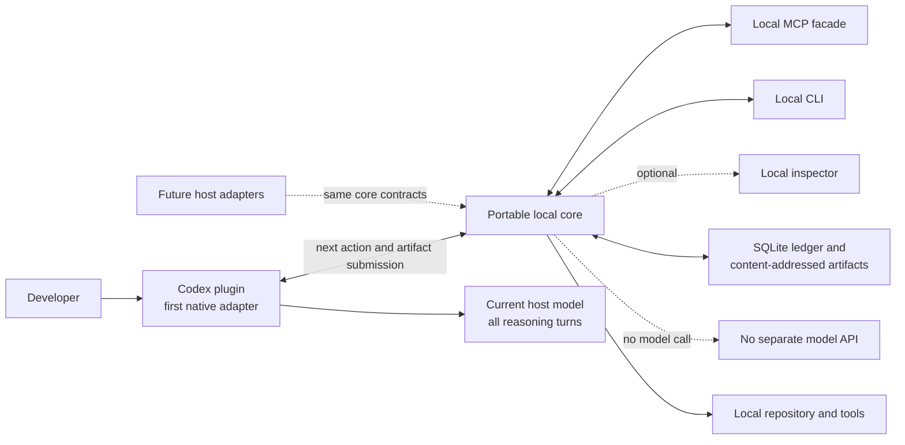

# ADR-0001: Portable Local Core with a Codex-First Plugin

**Status:** Accepted

**Date:** 2026-07-15

**Decision scope:** Initial Telic product and deployment shape

**Implementation status:** The portable TypeScript core, local STDIO MCP server,
CLI, and source-built Codex plugin now implement this decision. Other host
adapters and the visual inspector remain planned; see
[`../STATUS.md`](../STATUS.md).

## Context

Telic is intended to convert rough developer requests into repository-grounded, permission-aware, inspectable workflows. The proposed workflow uses five logical AI roles:

1. Scenario Author and Intent Guardian;
2. Prompt and Task Compiler;
3. Planner and Quality Controller;
4. Executor; and
5. Release Auditor and Reporter.

The product should feel native inside coding tools rather than requiring the user to copy requests into a separate website. It should use the model already available through the current coding host and should not require a separate model API key.

At the same time, coding hosts expose different capabilities for commands, plugins, rules, approvals, tools, subagents, and MCP. MCP is valuable for portable tools and resources, but it does not by itself guarantee interception of user messages, use of a particular host model, or native subagent creation across all clients.

The local Telic runtime cannot honestly promise to invoke the host model on its own without a separate model API. Therefore, the host agent must drive the turn-by-turn loop: obtain the next typed action from Telic, execute the logical role with the host-provided model, and submit the resulting artifact. Native subagents are an optional host capability, not a portable assumption.

The design therefore needs:

- a native first experience;
- a portable source of truth for workflow state and artifacts;
- a local deterministic controller;
- optional multi-agent execution;
- a tool protocol that more than one client can consume;
- a development and diagnostic surface;
- local inspectability; and
- a credible path to additional host adapters.

## Decision drivers

- Minimize user friction in the first supported coding host.
- Reuse the current host's model and entitlement.
- Avoid coupling core state and artifact schemas to one host.
- Keep permissions, state transitions, retries, and budgets deterministic.
- Support five logical roles without requiring five concurrent agents.
- Preserve exact evidence and provide inspectable rationale summaries.
- Operate locally for repository privacy and hackathon feasibility.
- Demonstrate one reliable vertical slice before broad host compatibility.
- Avoid treating MCP as a universal agent runtime.

## Decision

Telic will be designed around a **portable local core with a Codex plugin as the first host adapter**.

The proposed product shape consists of:

1. **Portable local core**
   - finite-state workflow controller;
   - typed and versioned artifacts;
   - policy, permission, budget, and retry enforcement;
   - repository context routing and compression;
   - local run ledger and content-addressed artifact storage;
   - host-turn-driver, graph-provider, and tool-broker interfaces; and
   - trace projection.

2. **Codex plugin first**
   - native user entry points;
   - use of the current Codex model;
   - host-driven retrieval of next actions and submission of role artifacts;
   - mapping of logical roles to Codex-native agent capabilities;
   - optional native subagent execution;
   - approvals and clarifications;
   - progress presentation; and
   - final result delivery.

3. **Local MCP facade**
   - deterministic tools and resources;
   - run, artifact, context, and trace inspection;
   - approval and resume operations where supported; and
   - a portable integration surface for compatible clients.

   The MCP server stores state and exposes deterministic operations. It never calls a model API.

4. **Local CLI**
   - development and diagnostics;
   - configuration and schema validation;
   - run inspection;
   - automated integration testing; and
   - a fallback entry surface.

5. **Optional local inspector**
   - structured visualization of TaskContract versions, role inputs and outputs, context selection, tool evidence, scores, budgets, and stop reasons;
   - no display or storage of private chain-of-thought.

The core will coordinate five **logical** roles by publishing typed next actions. The host turn driver executes those actions using the current host model and submits typed artifacts. The local core and MCP server never call a model API.

A host may execute the roles as:

- native isolated subagents;
- serial role turns in the same host session with explicit context boundaries;
- a direct single-agent path for simple requests; or
- bounded parallel workers for suitable tasks.

The deterministic controller, not Agent 3, remains responsible for scheduling, state, permissions, schemas, and loop limits. Agent 3 remains the semantic planner and quality reviewer.

The user request is compiled into an explicit outcome mode: `report_only`, `analyze_only`, `fix_only`, `analyze_and_fix`, or `plan_only`. Clarification is conditional and occurs only after safe repository/runtime inspection leaves a user-owned ambiguity that materially changes scope, authorization, or execution.

## Decision diagram

## Alternatives considered

### Alternative A: Codex-only implementation

Build all workflow behavior directly into Codex-specific prompts, skills, hooks, and agent definitions.

Advantages:

- shortest path to an initial native demonstration;
- maximum use of Codex-specific capabilities; and
- fewer components at the beginning.

Disadvantages:

- core state and artifacts become host-specific;
- future adapters require extensive reimplementation;
- deterministic policy and trace behavior may be scattered across prompts;
- difficult to test independently from the host; and
- portability becomes a rewrite rather than an adapter.

Reason not selected:

Codex remains the first integration, but the source of truth should be a portable core.

### Alternative B: MCP-only universal server

Expose Telic entirely as an MCP server and expect every host to use the same workflow.

Advantages:

- apparently simple interoperability story;
- standard tools and resources; and
- centralized local implementation.

Disadvantages:

- MCP does not universally intercept user prompts;
- host support for sampling and agent creation differs;
- a server cannot safely assume access to the host's exact model or native subagents;
- approvals and interactive lifecycle behavior vary; and
- the product could degrade into a collection of manual tools.

Reason not selected:

MCP is retained as a useful facade, but native host adapters are required for the intended low-friction experience.

### Alternative C: Standalone web application or hosted service

Create a separate prompt laboratory, web interface, or cloud orchestrator.

Advantages:

- complete control over UI and workflow;
- uniform runtime; and
- easier centralized analytics.

Disadvantages:

- introduces the external friction the product is intended to remove;
- usually requires separate model credentials or hosted inference;
- expands privacy, authentication, and operational scope;
- weakens native repository and tool integration; and
- is too broad for the initial hackathon vertical slice.

Reason not selected:

Telic should operate inside the developer's existing coding workflow and remain local-first.

### Alternative D: Decentralized autonomous swarm

Allow peer agents to negotiate tasks, communicate freely, and continue until they reach consensus.

Advantages:

- flexible emergent decomposition;
- appealing multi-agent demonstration; and
- potential parallel exploration.

Disadvantages:

- unpredictable latency and cost;
- difficult permission enforcement;
- poor reproducibility;
- hard-to-explain stopping behavior;
- duplicated context; and
- quality may be confused with agent consensus.

Reason not selected:

Telic needs bounded, inspectable orchestration. Optional parallel subagents remain available inside a deterministic plan.

## Consequences

### Positive

- Users receive a native Codex-first experience.
- The host-driven loop can perform all logical roles through the same host model without another model API.
- Core state, artifacts, context behavior, and quality gates remain portable.
- MCP can expose useful tools and resources without being overextended.
- The CLI enables testing and diagnostics outside an interactive host session.
- Native subagents can improve suitable tasks without becoming a requirement.
- Local persistence supports resume, replay, evidence provenance, and inspectability.
- Future host integrations can target stable adapter contracts.

### Negative

- The MVP has more architectural pieces than a prompt-only Codex skill.
- The Codex adapter and portable core must coordinate an asynchronous role-invocation lifecycle.
- Some host-specific behavior cannot be normalized cleanly.
- Maintaining schemas and adapter compatibility introduces versioning work.
- Local MCP, CLI, plugin, and optional inspector surfaces can create scope pressure.
- Sequential fallback may have different latency and isolation characteristics from native subagents.

### Risks

- The portable abstraction may be designed before enough host behavior is known.
- The plugin may not expose every capability desired by the proposed host turn driver.
- Context routing may consume more implementation time than the core workflow.
- A local inspector could distract from the end-to-end MVP.
- Users may misinterpret role traces as private model reasoning.

Mitigations:

- implement one thin vertical slice before generalizing interfaces;
- validate host capabilities through small spikes;
- keep the inspector optional and terminal trace authoritative;
- use simple ripgrep and Tree-sitter retrieval before optional graph providers;
- label every component and feature as proposed until verified; and
- expose structured decisions and evidence, never private chain-of-thought.

## Boundaries fixed by this decision

- Telic is local-first for the MVP.
- Codex is the first native adapter.
- The portable core owns deterministic workflow control and typed artifacts.
- The current host model is used; no separate model API is required.
- The host agent drives every reasoning turn by retrieving a next action and submitting its typed result.
- Native subagents are used only when the host exposes them; otherwise roles run serially with explicit context boundaries.
- MCP is a local facade, not the sole integration strategy.
- The CLI is a supported development and diagnostic surface.
- The inspector is optional.
- Five roles are logical and may execute sequentially.
- Multi-agent execution is conditional.
- Context compression preserves raw source artifacts and provenance.

## Boundaries not fixed by this decision

- implementation language;
- exact Codex plugin APIs;
- packaging and process topology;
- final MCP tool names;
- artifact schema field details;
- user-interface framework for the optional inspector;
- exact graph-ranking algorithm;
- whether a future hosted collaboration layer exists; and
- the order and scope of post-Codex adapters.

## Proposed validation criteria

This decision should be revisited after a vertical-slice spike demonstrates:

1. a Codex entry point can start a local core run;
2. a host-driven next-action loop can coordinate all five logical roles through the same host model;
3. sequential fallback works without native subagents;
4. the controller can enforce analyze-only versus analyze-and-fix behavior;
5. typed artifacts survive validation and persistence;
6. Agent 1 can request at most one Agent 2 revision;
7. Agent 3 and Agent 5 consume one shared post-execution remediation budget;
8. a repository-grounded context pack can be generated locally;
9. tool evidence and permission decisions appear in the trace;
10. a run can complete or block with an evidence-backed user report; and
11. no separate model API credential is needed.

## Follow-up decisions

Proposed future ADRs:

- implementation language and package boundaries;
- artifact and event schema versioning;
- Codex host-turn-driver capability mapping;
- permission and approval model;
- local persistence and secret-redaction policy;
- context ranking and optional graph-provider interface; and
- MVP inspector inclusion or deferral.
